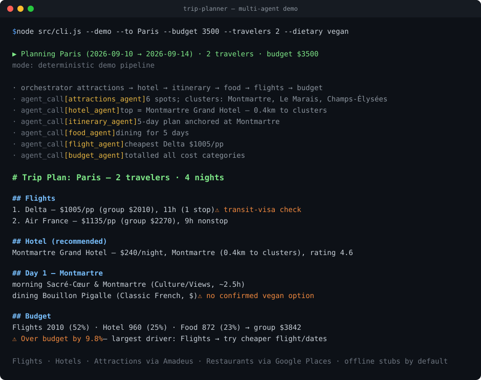

# Multi-Agent Trip Planner



A supervisor-pattern multi-agent system. One **Orchestrator** owns the
conversation and a single shared **TripContext** JSON object, and delegates to
six specialist **sub-agents** — Flight, Hotel, Itinerary, Food, Attractions,
Budget — calling each as a tool. The orchestrator never answers travel questions
directly; it delegates, reconciles, resolves conflicts, and presents one concise
plan.

Built on the Claude API (Messages + tool use). Runs in two modes:

| Mode | Needs API key? | What it does |
| --- | --- | --- |
| **LLM orchestrator** | Yes (`ANTHROPIC_API_KEY`) | Real Claude orchestrator calls real Claude sub-agents as tools; sub-agents call the data-source tools. |
| **Demo pipeline** | No | Deterministic offline pipeline driven straight from the stub data sources. Same TripContext, same conflict resolution, same output shape. |

If no key is set the CLI automatically falls back to the demo pipeline, so you
can run and inspect the whole flow today.

## Quick start

```bash
cd trip-planner
npm install                       # installs @anthropic-ai/sdk (optional for demo)

# Offline, no key needed:
node src/cli.js --demo
node src/cli.js --demo --to Paris --budget 1500 --dietary vegan --travelers 2

# With Claude (set your key first):
#   copy .env.example -> .env and fill ANTHROPIC_API_KEY, or export it
node src/cli.js --request "5 relaxed days in Paris for 2, love art and food, budget 4000" --to Paris

# Web UI / JSON API:
npm run server                    # http://localhost:3000
```

`--budget` set low (e.g. `--budget 1500`) triggers the conflict-resolution loop.
Try `--to Tokyo` or `--to Paris` for curated data; any other city gets a
deterministic generic catalog.

## Architecture

```
                 ┌──────────────────────────────────────────────┐
   user request  │              ORCHESTRATOR                     │
  ───────────────▶  owns TripContext, delegates, reconciles,     │
                 │  resolves conflicts, presents concise plan    │
                 └───┬───────┬───────┬───────┬───────┬───────┬───┘
       calls sub-agents as tools │       │       │       │
        ┌────────┬────────┬──────┴─┬─────┴──┬────┴────┬──┴──────┐
        ▼        ▼        ▼        ▼        ▼         ▼
   attractions  hotel  itinerary  food   flight    budget
      agent     agent    agent   agent   agent      agent
        │        │                 │       │
        └── each calls data-source tools ──┘
             searchAttractions / searchHotels / searchFlights / searchRestaurants
                         (stubs — swap for Amadeus / Booking / Google Places)
```

**Two levels of tool use:** the Orchestrator's tools are the sub-agents; each
sub-agent's tools are the data sources.

### Orchestration rules (enforced)
- `attractions_agent` runs **before** `hotel_agent`, so hotel search is biased
  toward the attraction clusters.
- `budget_agent` runs **last**, after prices are in.
- If budget is over by **>10%**, the system re-delegates to the largest cost
  driver for a cheaper alternative, then re-totals — before presenting.
- Nothing is fabricated: all stub data is tagged `is_placeholder: true` and the
  plan says the prices are estimates, not live quotes.

## Project layout

| File | Responsibility |
| --- | --- |
| `src/tripContext.js` | The shared TripContext schema, factory, validation, helpers. |
| `src/dataSources.js` | Stub `searchFlights/Hotels/Attractions/Restaurants` — **the swap point for real APIs.** |
| `src/prompts.js` | Orchestrator + all six sub-agent system prompts. |
| `src/subAgents.js` | Sub-agent definitions, LLM path, and matching deterministic path. |
| `src/orchestrator.js` | LLM agentic loop, deterministic pipeline, conflict resolution, formatter. |
| `src/anthropic.js` | SDK wrapper + a generic bounded tool-use loop. |
| `src/logger.js` | JSONL trace of every agent + tool call (`logs/run-*.jsonl`). |
| `src/cli.js` | Command-line entry point. |
| `src/server.js` | Optional web UI + `POST /plan` JSON API. |

## TripContext schema

```json
{
  "destination": "", "origin": "", "start_date": "", "end_date": "",
  "traveler_count": 1, "budget_total": null, "budget_currency": "USD",
  "preferences": { "cuisine": [], "dietary_restrictions": [], "interests": [], "pace": "moderate" },
  "constraints": [],
  "sub_agent_outputs": { "flights": null, "hotels": null, "attractions": null, "itinerary": null, "food": null, "budget": null }
}
```

## Real data — all four sources implemented

Every data source now uses a live API when its credentials are set, and falls
back to the stub otherwise. No agent logic changed — each provider returns the
same shape as its stub.

| Data source | Real API | Provider | Credential |
| --- | --- | --- | --- |
| `searchFlights` | Amadeus Flight Offers | [`amadeus.js`](src/integrations/amadeus.js) | `AMADEUS_*` |
| `searchHotels` | Amadeus Hotel List + Offers | [`amadeusHotels.js`](src/integrations/amadeusHotels.js) | `AMADEUS_*` |
| `searchAttractions` | Amadeus Tours & Activities | [`amadeusActivities.js`](src/integrations/amadeusActivities.js) | `AMADEUS_*` |
| `searchRestaurants` | Google Places (Text Search) | [`googlePlaces.js`](src/integrations/googlePlaces.js) | `GOOGLE_PLACES_API_KEY` |

Shared Amadeus OAuth/token, location→code+geo resolution, and geo/duration
helpers live in [`amadeusCore.js`](src/integrations/amadeusCore.js). The three
Amadeus sources share one credential set; restaurants use a Google key. Set
either, both, or neither — each source independently uses live data or the stub.

1. Get free test credentials at <https://developers.amadeus.com> (Self-Service).
2. Put them in `.env`:
   ```
   AMADEUS_CLIENT_ID=your_id
   AMADEUS_CLIENT_SECRET=your_secret
   ```
3. Run — flights, hotel, and attractions are now live (labeled `(live — Amadeus)`):
   ```bash
   node src/cli.js --demo --from NYC --to Paris --start 2026-09-10 --end 2026-09-14 --travelers 2
   ```
   `--demo` runs the deterministic pipeline; with credentials set it pulls live
   data underneath. Drop `--demo` (with `ANTHROPIC_API_KEY` set) to run the full
   LLM orchestrator over the same live data.

**What the integrations handle**
- **OAuth2** client-credentials token, cached until expiry.
- **Location resolution** — city names ("New York"/"Tokyo") → IATA codes + lat/long
  via the Airport & City Search API; 3-letter codes pass through. Cached.
- **Flights**: round-trip search (adults, currency, optional per-person price cap),
  carrier codes → names, ISO-8601 durations parsed, layover/transit warnings.
- **Attractions**: real APIs return coordinates, not neighborhoods — so results
  are **clustered geographically** (greedy within `CLUSTER_RADIUS_KM`, default
  1.8km) and each cluster is labeled by its most prominent stop (`Near <name>`).
  Cluster **centroids flow downstream** to bias hotels and group the itinerary.
- **Hotels**: list hotels in the city (with coordinates), rank by **real haversine
  distance** to the attraction-cluster centroids, then price the closest via the
  Hotel Offers API. Per-night = stay total ÷ nights.
- **Restaurants (Google Places)**: for each day, searches near that day's
  **attraction-cluster centroid** (real location bias) with the traveler's cuisine
  and dietary terms; maps Google price levels to `$`/`$$`/`$$$`, derives cuisine
  from the place type, and honestly flags a dietary conflict unless the venue is
  explicitly typed for the restriction (e.g. `vegan_restaurant`). With no
  coordinates it falls back to a `"<terms> restaurants in <place>"` text query.
- **Honest failure** — on any provider error a source falls back to the stub and
  tags the result `amadeus_error` / `google_error` (shown in the plan and logs),
  never a silent fake. `AMADEUS_FALLBACK=0` / `GOOGLE_FALLBACK=0` surface the
  error and return no results instead.

**Test-environment note:** Amadeus's *test* dataset is partial — some cities have
no activities or bookable hotel offers for a given date. If a source returns
nothing it falls back to the stub with the reason logged; try major hubs (NYC,
LON, PAR, TYO) and near-term dates for the fullest live data. Production keys
(`AMADEUS_BASE_URL=https://api.amadeus.com`) have full coverage.

### Enabling live restaurants (Google Places)

1. In Google Cloud, enable **Places API (New)** and create an API key.
2. Add it to `.env`:
   ```
   GOOGLE_PLACES_API_KEY=your_key
   ```
3. Run — the Food Agent now pulls live restaurants biased to each day's cluster
   (labeled `food: live (Google)` in the plan's data line).

All four sources are now real. To add more (e.g. car rental, rail), follow the
same pattern: a provider module under `src/integrations/`, a `withProvider(...)`
wrapper in `src/dataSources.js`, and the matching stub for offline/fallback.

## Debugging conflicting recommendations

Every run writes `logs/run-<timestamp>.jsonl` with one line per event:
`agent_call` (full input context + output), `tool_call` (each data-source call),
`orchestrator`, and `conflict`. Tail it to see exactly what each agent saw and
returned.

## Configuration

Environment variables (via shell or `.env`):

- `ANTHROPIC_API_KEY` — enables LLM mode.
- `ANTHROPIC_MODEL` — orchestrator model (default `claude-sonnet-5`).
- `SUBAGENT_MODEL` — sub-agent model (defaults to `ANTHROPIC_MODEL`).
- `LOG_DIR` — where traces are written (default `logs/`).
- `PORT` — web server port (default `3000`).
